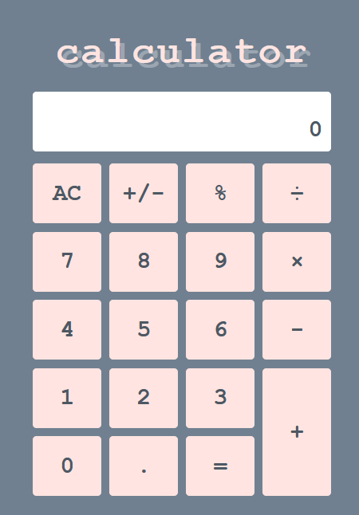

# A Simple Calculator

A modern calculator to solve your modern needs. Written in vanilla JavaScript, this app provides basic calculator functionality while providing a sleek and minimalist look.

<!--  -->
  
## Features
+ Offers basic operations and displays all commands as they are entered
+ Ability to change displayed value from positive to negative and vice versa
+ Can immediately calculate the percentage from the displayed value and use value in further operations

## License

Copyright &copy; Cecile Zhang. All rights reserved.

Licensed under the [MIT License](./LICENSE).
